# KiCAD Basics
Welcome to KiCAD Basics. This page is intended to walk you through the basics of using the open-source KiCAD (KEE-kad) EDA suite (electronic design automation) to design a printed circuit board (PCB).

## Basics

### What is a PCB?
from [Wikipedia](https://en.wikipedia.org/wiki/Printed_circuit_board):

*A printed circuit board (PCB) is a laminated sandwich structure of conductive and insulating layers. PCBs have two complementary functions. The first is to affix electronic components in designated locations on the outer layers by means of soldering. The second is to provide reliable electrical connections (and also reliable open circuits) between the component's terminals in a controlled manner often referred to as PCB design.  Each of the conductive layers is designed with an artwork pattern of conductors (similar to wires on a flat surface) that provides electrical connections on that conductive layer. Another manufacturing process adds vias, plated-through holes that allow interconnections between layers.*

### What is a PCB made of?
PCBs are commonly made of fiberglass, most commonly [FR-4](https://en.wikipedia.org/wiki/FR-4). FR-4 is a glass-fiber reinforced epoxy panel which can then be laminated with copper or copper foil on one or both sides. Multi-layer PCBs (more than two layers) might be produced by alternating copper and fiberglass layers.

### Who manufactures PCBs?

There are several manufacturers here in Connecticut that produce printed circuit boards in large quantities. Due to the prototyping nature of this course, PCBs will be ordered from [JLCPCB](https://jlcpcb.com), a Chinese company that provides rapid, low-cost PCB fabricating services.

# PCB Design Process
* Getting started
* Idea
  * Choosing components
* Creating the project
* Schematic
  * Symbols
  * Wires
  * Nets (local/global)
  * Footprints
    * Assigning
    * Sourcing/Importing
  * Electrical Rules Checck
* Layout
  * Design Rules
  * Placement
    * Layers (`Copper`, `Silks`, `Edge.cuts`)
  * The Rats Nest
  * Routing Traces
    * Trace Widths
    * Direction / Orientation
    * Vias
  * Design Rules Check (DRC)
  * Plotting (`Gerbers` and `Drill Files`)
    * Ordering

## Getting started
The remaineder of this document will walk you through the design of a simple circuit board. Screenshots will show the author using Windows, but KiCAD is available for MacOS and Linux as well and works almost identically on those platforms. This guide will assume you are using KiCAD 6.0.2, the latest stable release as of writing, which [can be downloaded from KiCAD.org here](https://www.kicad.org/download/).

## Idea

What will you make? Before getting started, you'll want to have a general idea of what components you'll be using, even if you haven't decided  on specific `packages` (the manufacturer/supplier scheme for standardized naming of the footprint, or physical layout, of components of the same size). For schematic design, the first step of the process, you'll need just the electrical purpose of the components so that you can explain (to KiCAD) how the components will work together. It's not as complicated as it might sound.

## Creating the project
At this point the guide will assume you have downloaded and installed KiCAD. Open it up, click the File menu, and select `New Project...`.

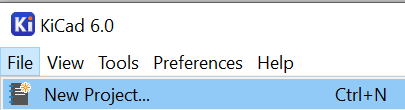

You will be prompted to select a location and name and save your project, which will create the following structure automatically.

```
project_name (folder)
  project_name.kicad_pcb (pcb design file)
  project_name.kicad_sch (schematic design file)
```

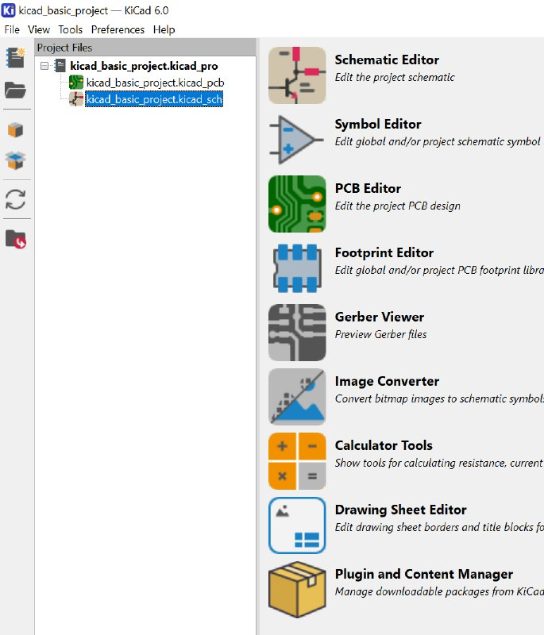

## Schematic

Double click on `project_name.kicad_sch` to open the schematic file and get started.

If you are prompted to configure the **Global Symbol Library Table**, go ahead and choose the recommended option and click OK. This should only happen on the first time you launch KiCAD.

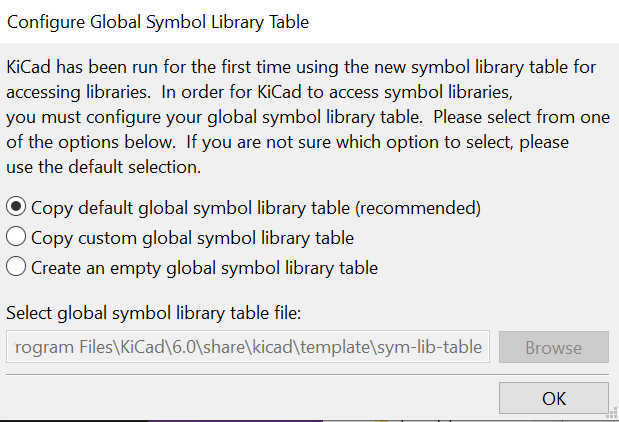

### Components/Parts

We'll start by placing an LED, a resistor, a battery, and a button. Where possible, this guide will try to share the Windows keyboard shortcuts for functions used. Many of these are the same on other platforms, but can be referenced by clicking `Help -> List Hotkeys` (`Ctrl+F1`).

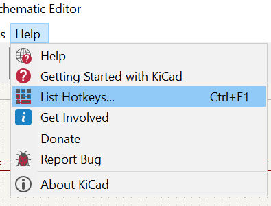

To place your first component, select `Place -> Add Symbol` or press (`A`).

In the "Choose Symbol" dialogue that appears, type "led" and *double click* on the first option "LED"

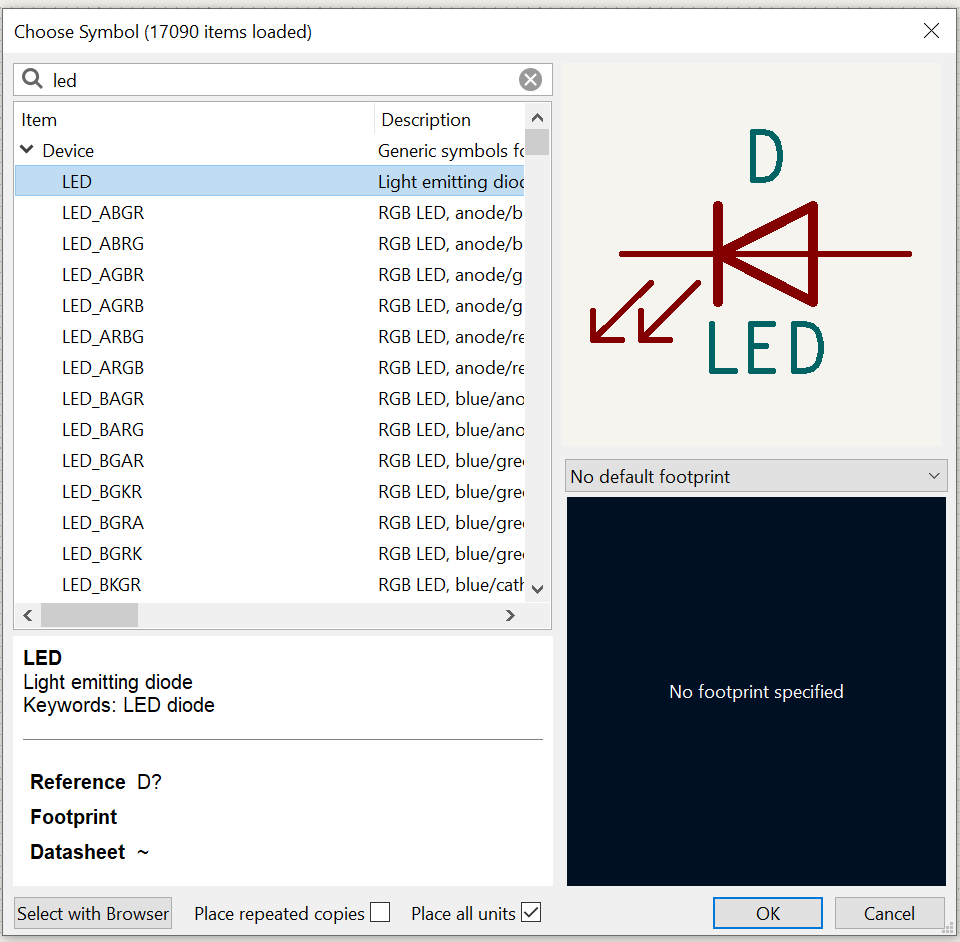

Then click to place the LED symbol onto your work area.

Repeat for your resistor (R), button (SW_Push), and battery (Battery_cell), using the text in parentheses to identify each component in the filter.

Quick Tips:
* Right click on a component symbol (not its text) for a context menu of actions or changes.
* Single click a symbol to select that component. Use (`R`) to rotate 90° clockwise or (`M`) to move a component.


### Wiring

Starting from the battery, begin to route the wires for your circuit. Hover your cursor over the circle at the positive pin of the battery cell and a green pencil will appear. Single click to begin routing.

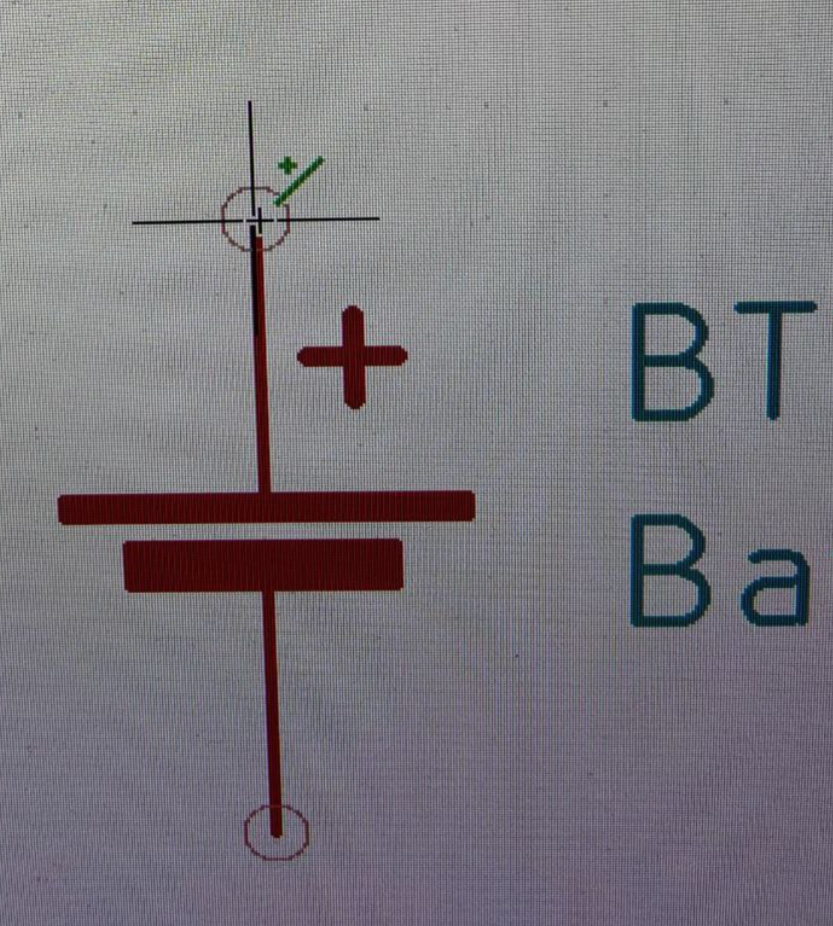

*Author's note: My apologies, the Windows snipping tool doesn't readily allow capture of the cursor, so this screenshot was taken from my phone.*

Move your cursor to one pole of the switch and click the open circle at the end of its pin to complete the wire. The circles at the wire should have disappeared at this point. If you misplace a wire, select it with a single click and press the Delete key to remove it.


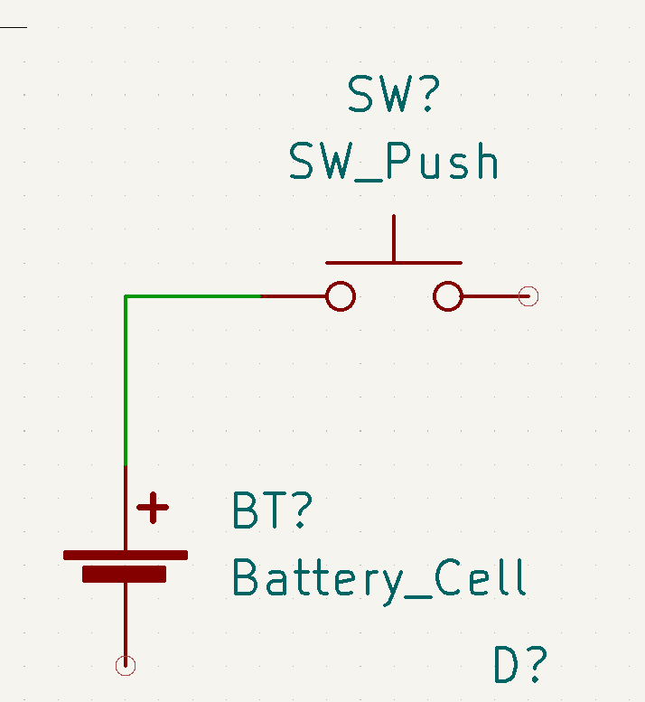

Repeat this process to connect the remainder of your components as shown below.

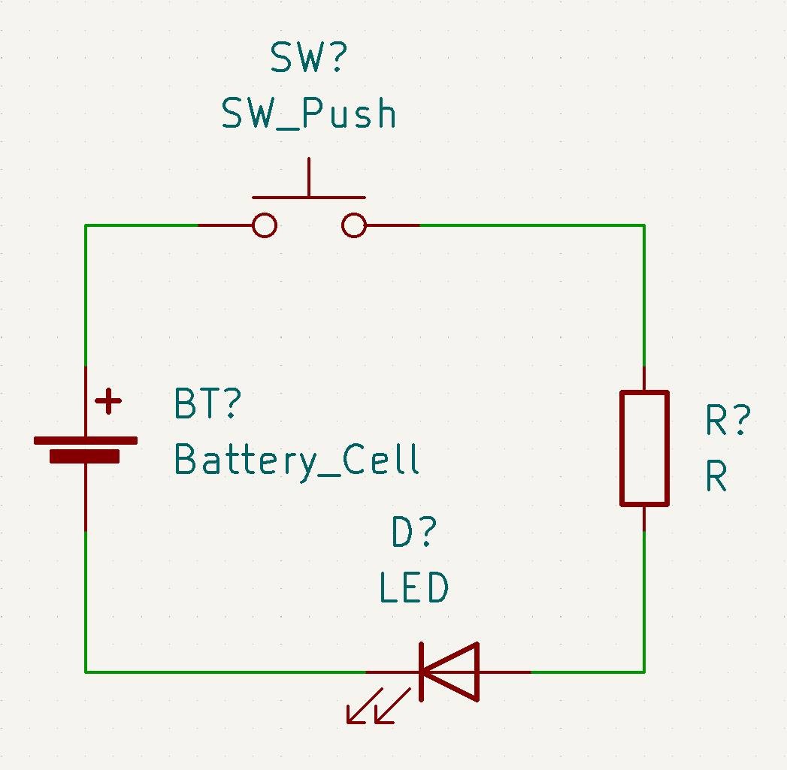

Lastly, double click on the R by the resistor symbol and the "Edit Value Field" box will appear. To make component selection easier later, note here that this will be a 220Ω (ohm) resistor by entering 220. Because resistors are always measured in Ohms, we don't need to specify a unit. Then click OK.

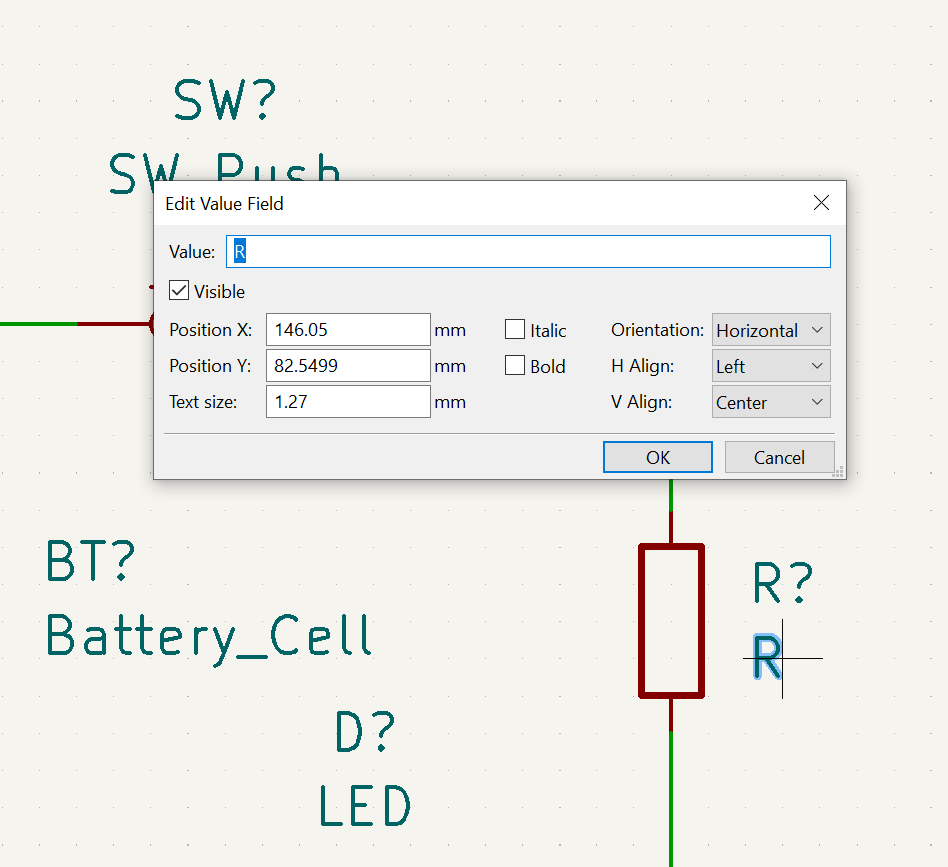

### Annotation and Footprint choice
The last two steps of the process are annotating the schematic (which will replace the question marks of each symbol with sequential numbers for that symbol) and assigning footprints (which chooses a physical layout for that component when we enter the PCB design phase).

We'll select the "Run Footprint Assignment Tool" button from the top toolbar, which will start both processes, but both the "Annotate Schematic" and "Assign Footprints..." functions can be started individually from the `Tools` menu at the top of the window.

In the first `Annotate Schematic` pop-up, you can click `Annotate`.

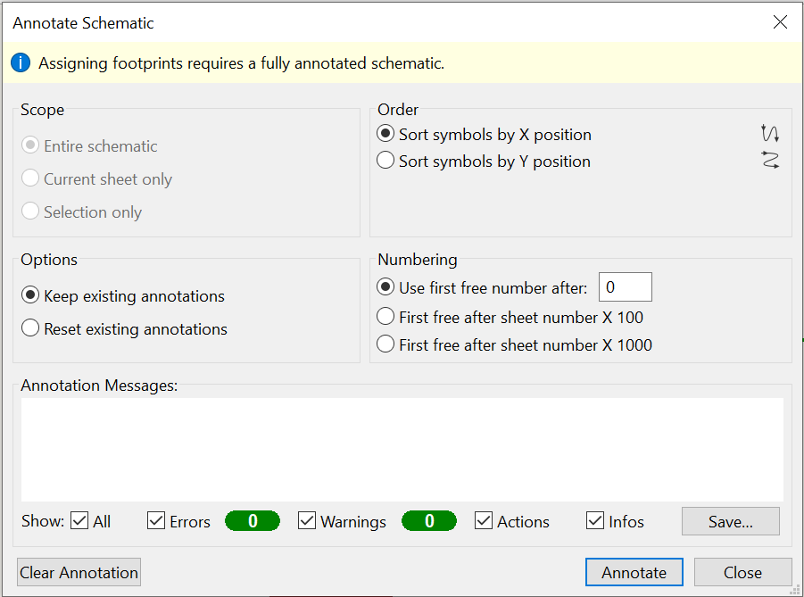

Next you'll see the `Assign Footprints` dialogue appear.

Selecting a library from the `Footprint Libraries` column on the left will provide a list of `Filtered Footprints` in the rightmost column. Select a symbol in the center column and then double click an entry from the `Filtered Footprints` list to assign it to that symbol.

#### Quick Tip:
* Right click on an entry in the `Filtered Footprints` column and choose `View Selected Footprint` if you'd like to see a scale layout of the option you're choosing.

For the purposes of this example, we'll use the following: (Format is Library:Footprint)
* BT1 (Battery) - Battery:BatteryHolder_Keystone_3002_1x2032
* D1 (LED) - LED_THT:LED_D5.0mm
* R1 (Resistor) - Resistor_SMD:R_2010_5025Metric
* SW1 (Button) - Button_Switch_THT:SW_TH_Tactile_Omron_B3F-10xx

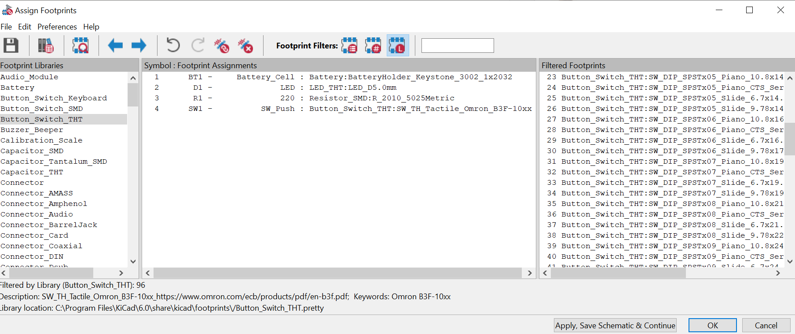

When you have these selected, press OK.

**These components were selected because their symbols and footprints were available in KiCAD's stock libraries. It's very likely you'll need to import symbol and footprint libraries as you continue to use KiCAD.**

**SMD components are surface-mount, meaning they do not have leads that travel through the circuit board. resistors and capacitors of this type are often noted in size using a format like 0805, where the dimensions of the package are 0.08 inches by 0.05 inches. The 2010 resistor used here would be 0.20 inches by 0.10 inches, making it a manageable size for hand-soldering. Hand-soldering 0805 and 0603 components with a pair of tweezers is difficult, but achieveable. Anything smaller than that would almost certainly be done with a machine by any but the most daring tinkerers.  THT components are Through-Hole, meaning they involve one or more holes drilled in the PCB.**

### Electrical Rules Check


The Electrical Rules Check tool will ensure that all of the pins on your components are connected and that there aren't any errors it's aware of. It's not perfect, and it won't always tell you if you make problematic connections, but if a component has specific pins designated as power (vs. signal) or if you have unconnected pins, it will throw an error and point it out.

Click the `Perform Electrical Rules Check` button in the top toolbar. In the window that appears, press the `Run ERC` button. If the Errors and Warnings count are **zero**, as shown, you can close the window.

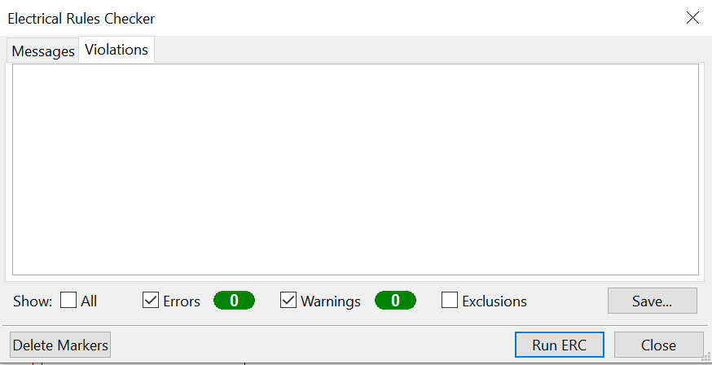

*While you aren't likely to have problems working on a project this simple, you should be in the habit of hitting the `Save` button frequently.*

That's it for the schematic! Hit the save button one more time and then close the window. This should bring you back to the KiCAD Launcher.

## Laying out the PCB.

From the launcher, either click `PCB Editor` or open the `project_name.kicad_pcb` file from the file list. Either action will open the `PCB Editor`.

### Update PCB with changes made to the schematic


Each time you make changes to the schematic, you will need to update the data that the PCB Editor has. This can be Done by clicking the button shown above in the top toolbar.

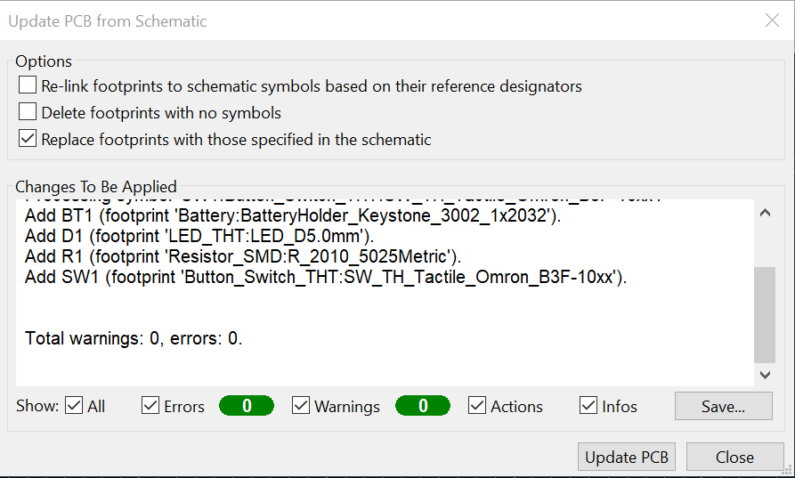

The dialogue that appears will give you a summary of the changes to be made. If all looks good, click `Update PCB` and then `Close`. Then choose a location in your work area and click to drop the component footprints.

### Set the Design Rules
Each PCB manufacturer has specific capabilities or specifications that it is able to manufacture, usually with regard to clearance, hole sizes, and width of copper traces. You can [find JLCPCB's Capabilites by clicking here](https://jlcpcb.com/capabilities/Capabilities). Click `File->Board Setup` and use the Design Rules tabs to configure the limitations that KiCAD will enforce. For example, JLCPCB cannot produce tracks/traces slimmer than 0.0127mm.

*When you get the design rules all filled in, click `OK`.*

### Arrange your components
Select each component and move it to its desired location. Either right-click and select `Move` or use the `M` key to pick up a component. Click to place. Make sure components don't overlap.

If you're having trouble getting components to line up as you'd like, use the grid selection menu (shown below) in the top bar to adjust the working grid that components will align to while moving. Making it bigger will keep components aligned at a larger scale. Making it smaller will enable fine movement. It's normal to switch your level of grid as you work. Larger settings while placing components, finer values while routing tracks/traces.

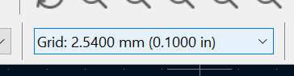

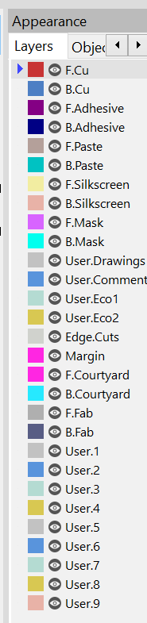
KiCAD drawings (layouts) are arranged in a series of layers, which specify what the drawing is used for. The important layers to start with are `F.Cu`, `B.Cu`, `Edge.Cuts`, `F.Silkscreen`, and `B.Silkscreen`.

`F` layers apply to the front of the board and `B` layers apply to the back. `Cu` layers are copper. `Silkscreen` layers are usually applied to the finished board in a white paint. Some manufacturers offer a variety of silkscreen colors, but JLCPCB only offers white. `Edge.Cuts` is used to note the outline of your board.

### Edge.Cuts
Select the `Edge.Cuts` layer by clicking on it in the Layer menu to the right. Then use the Rectangle or Circle tool to the right to draw an outline around your components. Note the grey rectangle around the components in the image below.

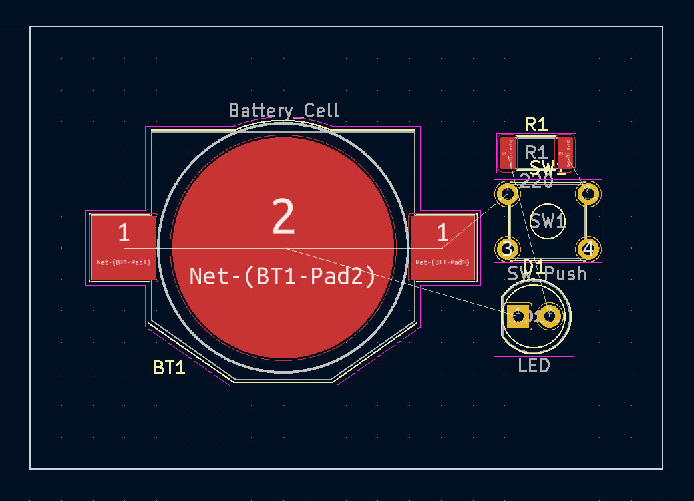

### 3D View
Check out what your board will look like in 3D by pressing `Alt+3` or clicking `View->3D Viewer`.

### The Ratsnest

On the image under Edge.Cuts above, you may have noticed a series of white lines drawn between the copper pads of the various components. These lines note connections that need to be made, and are referred to collectively as the board's ratsnest. When working on a more complicated design, the ratsnest may look incredibly chaotic.

### Route tracks

Press `X` to route tracks. Click a pad, the other pads it needs to connect to will highlight. Press `V` to use the via tool to poke a hole through to the other side of the board and continue your trace there. It's good practice to have your vertical vias on one side fo the board and your horizontal vias on the other. For this board it doesn't really matter but for a more complicated design it will make the job much easier.

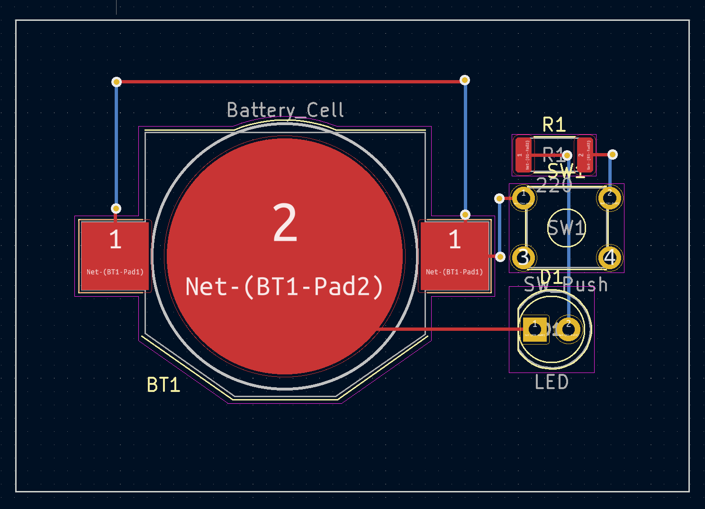
Above all tracks of the board are routed. Use vias. Avoid right-angles in your traces. Use a small grid size to enable easier routing, especially as your design gets more complicated.

### Design Rules Check

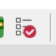
DRC checks your PCB for any violations of the design rules you set up at the beginning and any other concerns. As you can see, this board needs to have some of the silkscreen references so that they aren't cut off, but doesn't have any major errors. These warnings should be addressed before the board is ordered though.
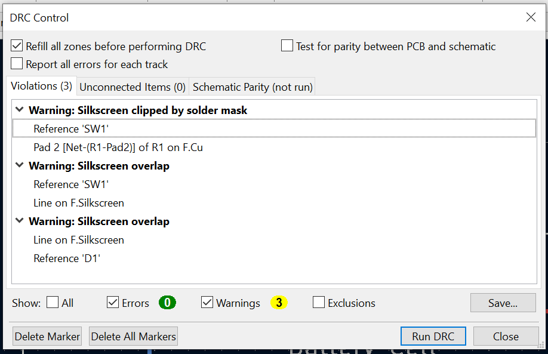

The rest coming soon....

## Plotting Gerber/Drill Files
## Ordering
